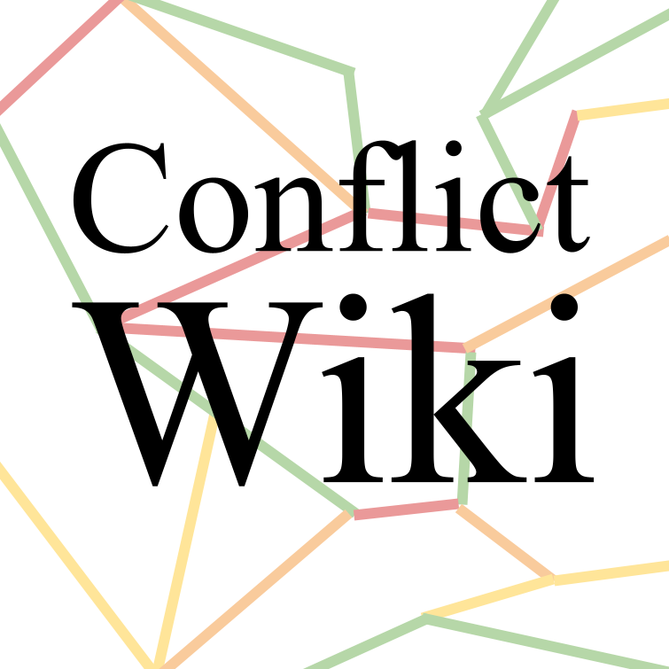

# ConflictWiki

<frontend src="experiments/images/favicon.png"  width="20" height="20" />

ConflictWiki is a scrape of Wikipedia articles on militarized conflict as described in our [paper](https://aclanthology.org/2021.emnlp-main.613/).
The data (v2, recommended) and data loading can be found [here](data/data_v2/load_data.ipynb). We also set up an experimental [frontend](https://conflict-ai.github.io/conflictwiki/) that allows you to quickly inspect the data (v1) as presented in the paper. 

⚠️ **Caveats:** ⚠️
___
**Outdated information**
Since the data scrape is from 25 January 2021, some information on Wikipedia has been updated in the meantime:
e.g., North Korea is not in the article on Al-Qusayr anymore, but used to be in the [old version of the Wikipedia page](https://en.wikipedia.org/w/index.php?title=Battle_of_al-Qusayr_(2013)&oldid=1032806148).

**Wrong hyperlinks**
The data contains some noisy entries and wrong hyperlinks due to the structure of Wikipedia:
e.g., in the [Raqqa Campaign infobox](https://en.wikipedia.org/w/index.php?title=Raqqa_campaign_(2016–2017)&oldid=1010322741), “Leftist and Anarchist volunteers” are hyperlinked as the entities “anarchism” and “left-wing politics”. 
___

We recommend running your own scrape to get an updated dataset.

- To this end, please download a Wikipedia dumb file from [here](https://dumps.wikimedia.org/backup-index.html).
- Then, run the scripts provided in `wb1retrieval` and `wb2dataprep` in the folder [code](code)

